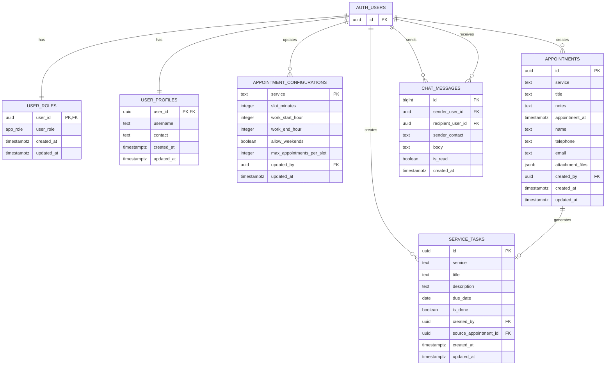

# MovePhysio

MovePhysio is a physiotherapy and pilates web platform with appointment booking, admin operations, and real-time support chat. It is built as a Vite + vanilla JavaScript frontend connected directly to Supabase (Auth, Postgres, Storage, and Realtime).

## Project Description

### What the project does

- Presents a public website for MovePhysio services and clinic information.
- Lets users register/login with email or phone and manage their session.
- Supports appointment workflows for Physiotherapy and Pilates.
- Provides admin workspaces for role management, appointment oversight, service task tracking, and support chat.
- Supports media/file management through Supabase Storage.

### User roles and permissions

- **Guest (anonymous)**
  - Can browse public pages.
  - Can read limited appointment availability data (policy-controlled).
  - Cannot access admin pages or authenticated chat actions.

- **Registered user (authenticated, role = `user`)**
  - Can register/login/logout.
  - Can create appointments and manage own appointment data where allowed by RLS.
  - Can use site chat (user-to-admin flow).
  - Can view/update own profile.

- **Admin (authenticated, role = `admin`)**
  - Full access to admin dashboard and task workspace.
  - Can manage roles in `user_roles`.
  - Can read/update/delete all appointments and service tasks.
  - Can manage appointment configuration rules.
  - Can participate in and moderate chat conversations.
  - Can manage protected media/storage operations via policies.

## Architecture

### Front-end

- **Stack:** HTML, CSS, JavaScript (ES Modules), Vite, Bootstrap Icons.
- **Rendering model:** client-side route rendering for public pages via `my/src/main.js` + `my/src/app.js`.
- **UI modules:** split by responsibility (`auth.js`, `admin.js`, `adminTasks.js`, `chat.js`, `i18n.js`, etc.).
- **Pages:**
  - `my/index.html` (public app)
  - `my/admin.html` (admin panel)
  - `my/admin-tasks.html` (admin task workspace)

### Back-end (Supabase)

- **Auth:** Supabase Auth for account lifecycle and JWT-based access.
- **Database:** Postgres schema in `public` with RLS enabled on key tables.
- **Storage:** media buckets for images/videos and appointment-related files.
- **Realtime:** chat table is added to realtime publication for live updates.

### Security model

- Role management is centralized in `public.user_roles`.
- SQL helper functions (`public.is_admin`, `public.is_owner_or_admin`) are used by RLS policies.
- Sensitive operations (role changes, admin updates/deletes, storage management) are restricted to admins by policy.

## Database Schema Design

Main schema entities and relationships:



### Notes

- `service_tasks.source_appointment_id` links generated operational tasks to appointments.
- Chat supports two modes via RLS constraints:
  - user messages with `recipient_user_id = null`
  - admin replies directed to a concrete recipient user.
- Schema evolution is tracked through SQL migrations in `supabase/migrations/`.

## Local Development Setup

### Prerequisites

- Node.js 18+ and npm
- A Supabase project with access to SQL editor/migrations

### 1) Install dependencies

From repository root:

```bash
npm install
npm --prefix my install
```

### 2) Configure environment

Create `my/.env.local` from `my/.env.example`:

```bash
copy my\.env.example my\.env.local
```

Set real values in `my/.env.local`:

```env
VITE_SUPABASE_URL=https://your-project-ref.supabase.co
VITE_SUPABASE_ANON_KEY=your-anon-key
# Optional alternative:
# VITE_SUPABASE_PUBLISHABLE_KEY=your-publishable-key
SUPABASE_SERVICE_ROLE_KEY=your-service-role-key
SUPABASE_MEDIA_BUCKET=movephysio-media
```

For Netlify deployment, set the same values in Site Configuration → Environment Variables.
The frontend supports both naming styles:

- `VITE_SUPABASE_URL` and `VITE_SUPABASE_ANON_KEY` (recommended)
- or `SUPABASE_URL` and `SUPABASE_ANON_KEY`

### 3) Apply database migrations

Run your Supabase migration workflow so all files from `supabase/migrations/` are applied in order.

### 4) Start local dev server

From repository root:

```bash
npm --prefix my run dev
```

Open the printed local URL (usually `http://localhost:5173`).

### 5) (Optional) Sync local media to Supabase Storage

```bash
npm --prefix my run sync:media
```

Dry-run preview:

```bash
npm --prefix my run sync:media -- --dry-run
```

## Key Folders and Files

### Root-level

- `README.md` — project documentation.
- `package.json` — root dependency metadata.
- `supabase/migrations/` — authoritative SQL migration history.
- `Images/` and `Videos/` — local source media used for storage sync.

### Frontend app (`my/`)

- `my/package.json` — app scripts (`dev`, `build`, `preview`, `sync:media`).
- `my/index.html` — public app entry point.
- `my/admin.html` — admin dashboard entry point.
- `my/admin-tasks.html` — admin service-task workspace entry point.
- `my/src/main.js` — app bootstrap, route rendering, live background, feature initialization.
- `my/src/app.js` — page templates/layout for public routes.
- `my/src/auth.js` — auth flows, session UI state, admin button visibility.
- `my/src/admin.js` — admin panel logic (roles, appointments, configurations, admin chat bootstrapping).
- `my/src/adminTasks.js` — admin task CRUD, metrics, appointment-linked task context.
- `my/src/chat.js` — site/admin chat UI + Supabase realtime integration.
- `my/src/config.js` — Supabase environment configuration loader.
- `my/scripts/sync-media-to-supabase.mjs` — uploads local Images/Videos to Supabase Storage.

## Available Scripts

From `my/`:

- `npm run dev` — start Vite development server.
- `npm run build` — production build.
- `npm run preview` — preview built app.
- `npm run sync:media` — upload media assets to Supabase bucket.
- `npm run seed:demo` — create demo auth users, set admin role, seed 4 appointments, and set task-board states (Active/Done/Overdue).

Run from repository root:

```bash
npm --prefix my run seed:demo
```

Requires `VITE_SUPABASE_URL` and `SUPABASE_SERVICE_ROLE_KEY` in `my/.env.local` (or `my/.env`).
